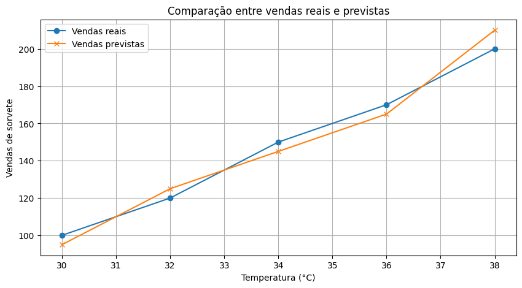
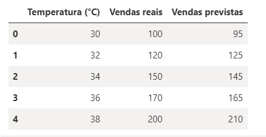

# 🍦 Previsão de Vendas de Sorvete com AutoML

Este projeto utiliza o Azure Machine Learning com AutoML para prever vendas de sorvete com base na temperatura. O modelo foi treinado, avaliado, registrado e utilizado dentro de um notebook interativo.

---

## 📁 Estrutura do Projeto
modelo-sorvetes-automl/<br>  ├── inputs/<br> │ └── vendas_sorvete.csv<br> ├── notebooks/ <br>│ └── modelo_sorvetes.ipynb<br> ├── imagens/<br> │ └── grafico_vendas.png<br> ├── README.md


---

## 🧠 Objetivo

Prever a quantidade de sorvete vendida com base na temperatura, utilizando aprendizado de máquina automatizado (AutoML) no Azure ML Studio.

---

## ⚙️ Tecnologias Utilizadas

- Azure Machine Learning Studio
- AutoML
- Python 3.9
- MLflow
- Pandas
- Matplotlib

---

## 📊 Resultados do Modelo AutoML

Abaixo estão as métricas de desempenho obtidas após o treinamento do modelo de previsão de vendas de sorvete com base na temperatura:

| Métrica                                         | Valor      |
|------------------------------------------------|------------|
| Variância explicada                            | 0.99531    |
| Erro absoluto de média (MAE)                   | 0.34277    |
| Erro percentual absoluto de média (MAPE)       | 0.73263    |
| Erro mediano absoluto                          | 0.087922   |
| Erro absoluto de média normalizado             | 0.0068553  |
| Erro mediano absoluto normalizado              | 0.0017584  |
| Erro quadrático médio normalizado (NRMSE)      | 0.014428   |
| Erro log de quadrado de média raiz normalizado | 0.015773   |
| Pontuação R²                                   | 0.99483    |
| Erro de raiz do valor quadrático médio (RMSE)  | 0.72138    |
| Erro log de raiz do valor quadrático médio     | 0.015150   |
| Correlação de Spearman                         | 0.99098    |

Esses resultados indicam que o modelo possui excelente capacidade preditiva, com alta explicação da variância e baixa margem de erro. A correlação de Spearman próxima de 1 reforça a consistência entre os valores previstos e reais.


---

## 📈 Gráfico de Avaliação

Comparação entre vendas reais e previstas:




---

## 📓 Notebook: `piperline_sorvetes.ipynb`

O notebook contém:

- Conexão com o workspace do Azure ML
- Carregamento do modelo registrado via MLflow
- Preparação dos dados de entrada
- Previsão com base na temperatura
- Visualização dos resultados

### 🔍 Exemplo de Uso

```python
from azureml.core import Workspace, Model
import mlflow.pyfunc
import pandas as pd

# Conectar ao workspace
ws = Workspace.from_config()

# Carregar modelo registrado
modelo = Model(ws, name='model_sorvetes')
modelo_path = modelo.download(exist_ok=True)
modelo_mlflow = mlflow.pyfunc.load_model(modelo_path)

# Entrada e previsão
df_entrada = pd.DataFrame([[34.0]], columns=["Temperatura (°C)"])
df_entrada["Temperatura (°C)"] = df_entrada["Temperatura (°C)"].astype("float64")
previsao = modelo_mlflow.predict(df_entrada)
print("Previsão de vendas:", previsao[0])
```
---
## 🧠 Conclusão e Aprendizados

Este projeto foi uma jornada prática e enriquecedora no uso de inteligência artificial para resolver um problema real: prever vendas de sorvete com base na temperatura. Ao longo do processo, foi possível aprender como:

- Utilizar o **Azure Machine Learning Studio** para treinar modelos com AutoML de forma automatizada e eficiente.
- Registrar e carregar modelos com **MLflow**, respeitando o esquema de entrada e as dependências do ambiente.
- Preparar dados corretamente, garantindo que os tipos e nomes de colunas estejam alinhados com o modelo.
- Interpretar métricas de avaliação como R², MAE, RMSE e correlação de Spearman para validar a performance preditiva.
- Visualizar os resultados com gráficos e tabelas, facilitando a comunicação dos insights gerados.

Mais do que apenas prever vendas, este projeto mostrou como integrar ferramentas modernas de machine learning em um fluxo de trabalho acessível e replicável. O conhecimento adquirido aqui pode ser aplicado em diversos contextos — desde análise de negócios até projetos acadêmicos e profissionais.

